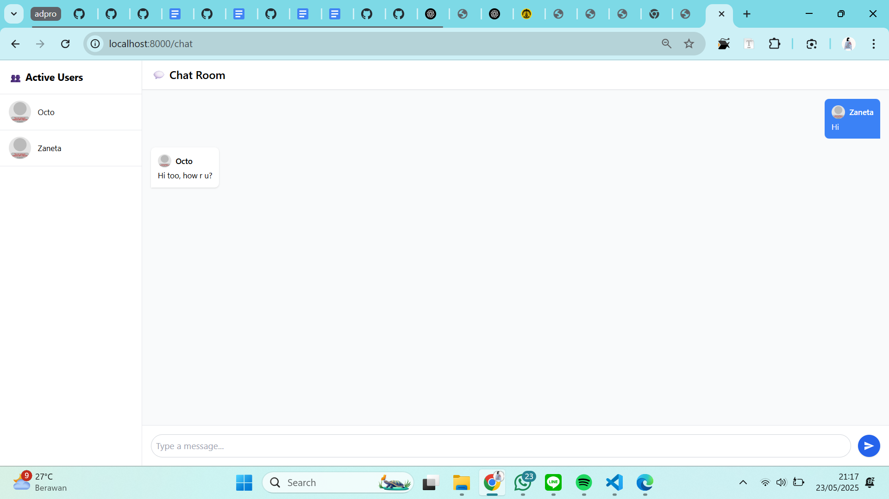

# Reflection
## Original code

I cloned the source code and followed the tutorial on the blog. I experimented by chatting using two users.

## Add some creativities to the webclient

I improved the design slightly and differentiated between sent and received messages. This makes the web chat look more like a modern chat application.
